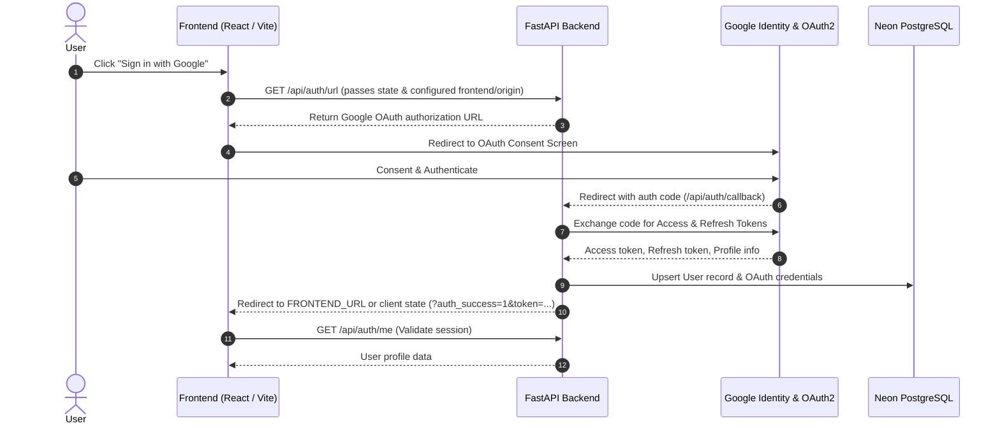
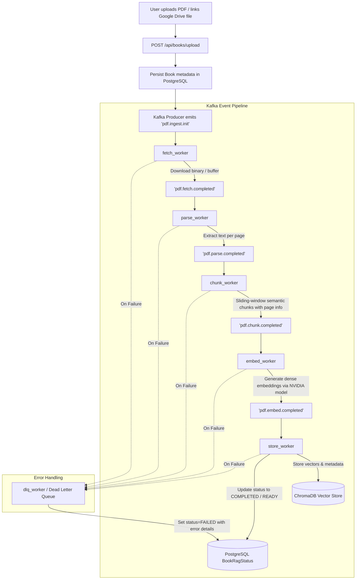
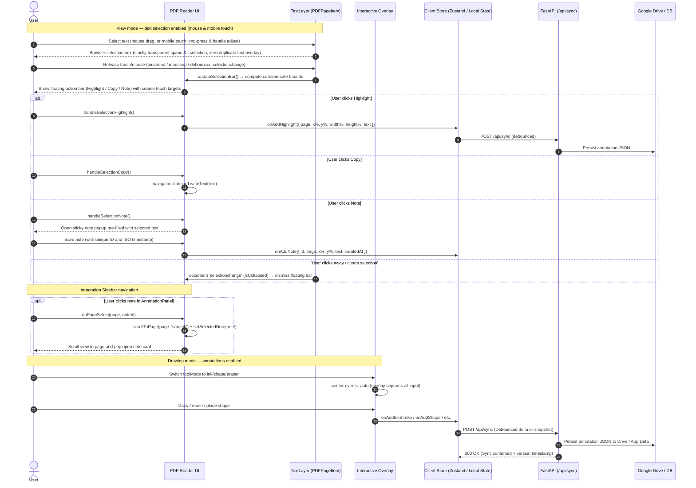
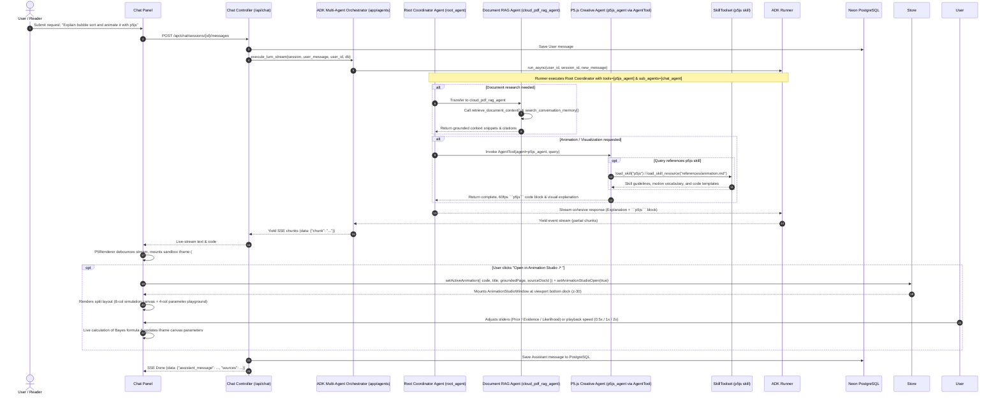
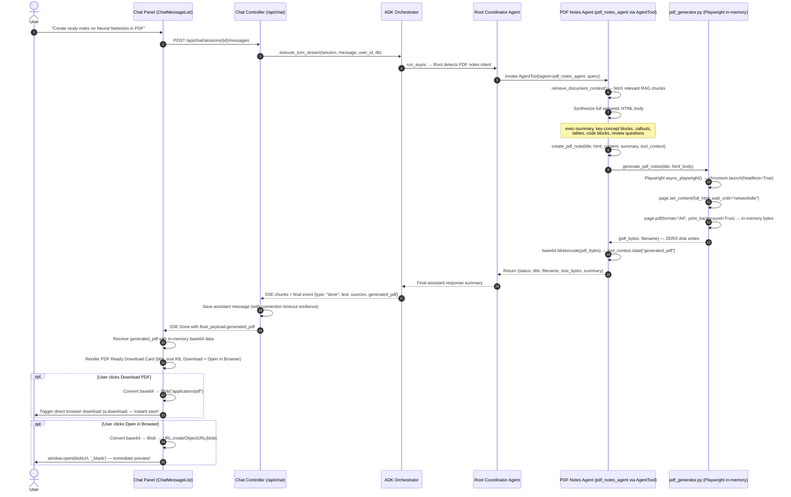
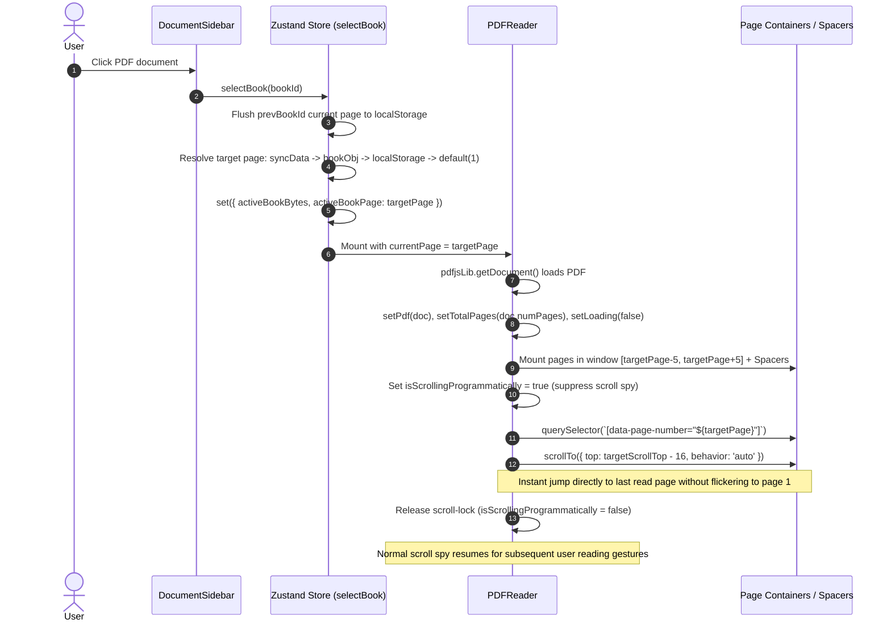

# System Flows & Data Pipelines: Cloud PDF Reader

This document details the primary lifecycle and data flows within **Cloud PDF Reader**, covering user authentication, PDF ingestion, annotation synchronization, and RAG chat interaction.

---

## 1. Authentication & Session Flow

---

## 2. Book Ingestion & Kafka Processing Pipeline

When a user imports or uploads a book, it is pushed through an asynchronous Kafka pipeline for text extraction, chunking, embedding, and vector storage.

---

## 3. Reading, Annotation & Text Selection Flow

### 3.1 Floating Toolbar & Header Navigation Interactions
- **Main Top Navigation Bar**:
  - Borderless, glassmorphic floating header (`backdrop-blur-xl`) that minimizes text in favor of sleek, intuitive icon buttons.
  - Hosts the Library drawer toggle, document title and current page pill, a subtle sync status dot, semantic search trigger with `⌘K`, compact view mode icon switcher (`PDF` / `Markdown` / `Split`), notes drawer toggle icon, and glowing **AI Copilot** action pill.
- **Floating Document Toolbar**:
  - Floats cleanly above the PDF canvas as an uncluttered pill dock (`rounded-full`, `shadow-[0_4px_24px_-2px_rgba(0,0,0,0.08)]`, `backdrop-blur-xl`) with wrapper border and heavy backgrounds removed.
  - Groups secondary tools into clean drop-down menus:
    - **Shapes & Tools Dropdown**: Consolidates Rectangle, Circle, Line, Arrow, Text Box, and Eraser into a single popover.
    - **Palette Swatch Dropdown**: Interactive popover for annotation colors.
  - Keeps essential primary reading controls directly accessible: Page jump `<` / `Page / Total` / `>`, Navigate, Highlight, Note, Pen, Zoom controls, and Thumbnail view toggle.

---

## 4. Google ADK 2.0 Multi-Agent Orchestration & Animation Flow

### 4.1 On-Demand Interactive Animation Studio Window Lifecycle
1. **Trigger**:
   - In `ChatMessageList`, any message containing a p5.js block or full HTML simulation displays an **"Interactive Concept Simulation"** banner with an **"Open in Animation Studio ↗"** button.
   - Alternatively, clicking the studio button in `P5Renderer`'s controls or inline canvas overlay directly triggers the studio.
2. **State Transition**:
   - Updates `useAppStore`:
     - `activeAnimation`: Holds the clean executable code, parsed simulation title, grounded page number, and source document ID.
     - `animationStudioOpen: true`.
3. **Viewport Mounting**:
   - `AnimationStudioWindow` mounts within `MainDashboard`'s main document viewport at `bottom-3 left-4 right-4 md:left-6 md:right-6 z-30`.
   - Floats above the PDF/Markdown reader with a glassmorphic aesthetic (`backdrop-blur-xl`, `border-[#fa5d19]/25`, `rounded-2xl`).
4. **Interaction & Playground**:
   - Header provides `0.5x / 1x / 2x` speed toggles, simulation replay, code view toggle, fullscreen mode, and dock/minimize.
   - Grounded page badge allows one-click jumping back to the referenced section in the PDF reader.
   - Parameter sliders dynamically update variables and re-compute formula results in real-time.
   - "Collapse to Chat" minimizes the window and refocuses the AI chat drawer.

---

## 4.2 PDF Notes Generation Lifecycle

When the user asks for "study notes", "revision notes", "PDF export", or "study guide", the system runs the following flow:

### 4.2.1 PDF Notes Tool Flow

1. **Intent Detection**: Root agent identifies PDF notes intent via keyword triggers in the prompt (`generate notes`, `study guide`, `revision notes`, `export notes to PDF`, etc.).
2. **RAG Context Retrieval**: `pdf_notes_agent` calls `retrieve_document_context` to pull relevant document chunks for grounded note generation.
3. **HTML Synthesis**: The LLM synthesizes a comprehensive semantic HTML body including:
   - `.exec-summary` — executive overview block
   - `.key-concept` — highlighted key definition blocks
   - `.callout.tip / .note / .warning / .formula / .important` — structured callout boxes
   - `<table>` — comparison or data tables
   - `<pre><code>` — code / pseudocode / formula blocks
   - `.review-questions` — end-of-notes self-assessment questions
4. **Playwright In-Memory Rendering**: `pdf_generator.py` wraps the HTML body in a full premium print document with Google Fonts, `@page` A4 rules, print-color-adjust, page-break utilities, and footer branding. Playwright's headless Chromium renders it directly to in-memory bytes with zero disk storage.
5. **Direct Client Delivery**: The PDF bytes are base64-encoded and attached to the SSE stream `final_payload.generated_pdf` (with title, filename, size, and summary).
6. **Frontend Card & Instant Download**: `ChatMessageList.tsx` receives `msg.generated_pdf` and renders an emerald **PDF Ready Card** with two instant actions:
   - **Download PDF**: Decodes the base64 string into a client-side `Blob("application/pdf")` and triggers an immediate file save to the user's computer.
   - **Open in Browser**: Converts the `Blob` into an ephemeral `URL.createObjectURL(blob)` and opens it in a new browser tab for immediate reading or printing.

---

## 5. PDF Page Rendering and Virtualization Lifecycle

Describes the rendering pipeline from PDF load to page display, including the virtualization and memory eviction strategies.

### Page Layer Stack (z-index order, bottom to top)

| z-index | Element | Purpose |
|---------|---------|---------|
| 0 | `<canvas>` (PDF canvas) | Rasterized PDF page via `page.render()` |
| 5 | `
` | Transparent, selectable text spans from `pdfjsLib.TextLayer` |
| 10 | `<svg>` (SVG annotation layer) | Permanent ink strokes, shapes, and highlights (`pointerEvents: none`) |
| 20 | `<canvas>` (ink canvas) | Live drawing preview — shown only during `ink`/`highlight` tool modes |
| 30 | `
` (interactive overlay) | Captures pointer events for all annotation tools; `pointer-events: none` in view mode |
| 40–60 | Annotation UI elements | Sticky note pins, delete bars, note popups, selection action bar |

### Key Invariants
- Annotation layers (SVG overlay, interactive div) are **independent** from the PDF canvas and never cause canvas re-renders.
- The **text layer** is rendered in a **separate, independent `useEffect`** from the canvas effect — text layer updates never trigger canvas re-renders and vice versa.
- `PDFPageItem` is wrapped in `React.memo`; toolbar color/tool changes do **not** re-render any page canvas.
- The `activeRenderTasks` and `activeTextTasks` module-level maps ensure at most **one active task per page** for each layer type.
- Spacer `div`s use real heights from `pageSizeCache` (populated via `onPageSizeChange` callback) or fall back to A4 estimates, preventing scroll position drift.
- Thumbnail rendering is deferred via `requestIdleCallback` so it never competes with main page rendering.
- DPR is dynamically managed by `computeAdaptiveDPR`: mobile devices with high-DPI screens render at full native DPR (up to 3.0–3.5) when scaled down for crisp text legibility, tapering gracefully as zoom increases to stay strictly within the 4096px dimension and 12MP hardware memory cap.
- Resolution changes (`matchMedia` dppx listener) and container width updates trigger crisp re-renders automatically without lag or layout thrashing.
- In **annotation** modes (ink, shape, highlight, eraser, note, textbox), the overlay has `pointer-events: auto` and `user-select: none` to capture all drawing interactions.

### Rendering Flow Summary
1. PDF loaded → `pdfjsLib.getDocument` (Web Worker thread)
2. Continuous mode: compute window `[currentPage-5, currentPage+5]` (PRELOAD_WINDOW=5) to keep adjacent pages mounted and prevent unmount/remount thrashing during continuous scrolling
3. Pages in window → mount `PDFPageItem`; pages outside → height-preserving spacer div
4. `IntersectionObserver` (rootMargin=1000px) triggers **canvas render** when page enters margin
5. `IntersectionObserver` (same observer) triggers **text layer render** when page enters margin
6. `IntersectionObserver` clears canvas + zeros dimensions + evicts text layer DOM when page exits margin
7. Each render cancels the previous `RenderTask` / `TextLayer` for that page before starting a new one
8. Thumbnails rendered at scale 0.2 via `requestIdleCallback`, canvas released immediately after `toDataURL`
9. `PDFPageItem` reports exact rendered dimensions to `PDFReader` via `onPageSizeChange` → `pageSizeCache`
10. Programmatic scroll loop prevention: User scrolling continuous reading updates `currentPage` without firing competing programmatic smooth-scroll interruptions.
11. **Last Read Page Restoration**: When opening any PDF, `selectBook` checks `syncData.books[id].currentPage`, `book.currentPage`, and synchronous `localStorage` fallback. On mount, `PDFReader` suppresses scroll spy with programmatic scroll-lock (`isScrollingProgrammatically = true`), queries the target page container or height-preserving spacer, and performs an instant jump (`behavior: 'auto'`) directly to the last read page before re-engaging the scroll spy.

### 5.1 Last Read Page Restoration Flow

