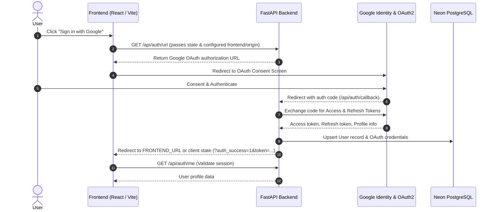
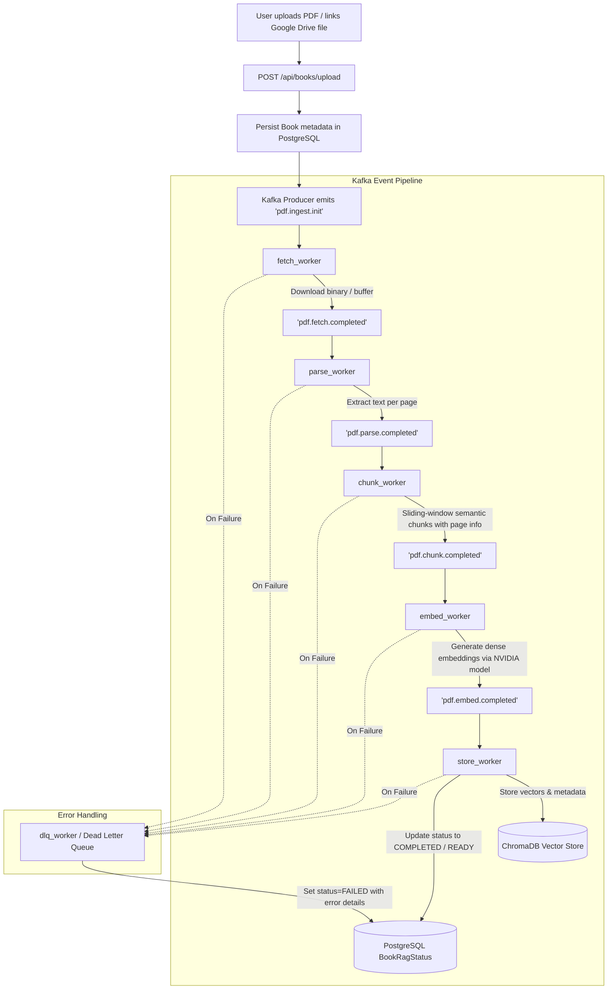
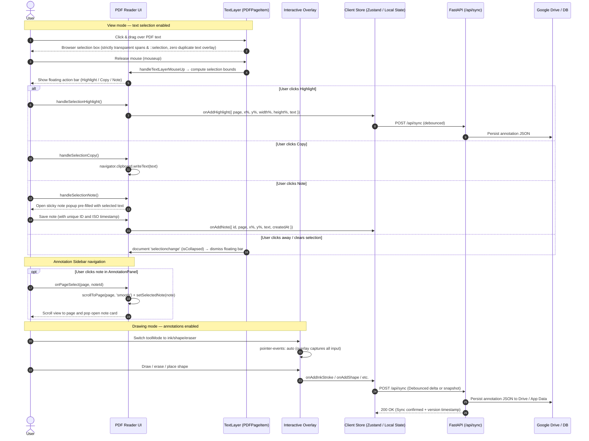
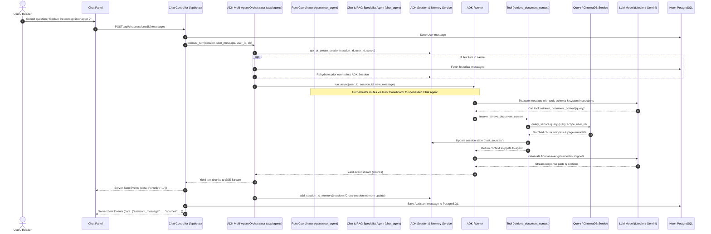

# System Flows & Data Pipelines: Cloud PDF Reader

This document details the primary lifecycle and data flows within **Cloud PDF Reader**, covering user authentication, PDF ingestion, annotation synchronization, and RAG chat interaction.

---

## 1. Authentication & Session Flow

---

## 2. Book Ingestion & Kafka Processing Pipeline

When a user imports or uploads a book, it is pushed through an asynchronous Kafka pipeline for text extraction, chunking, embedding, and vector storage.

---

## 3. Reading, Annotation & Text Selection Flow

---

## 4. Google ADK 2.0 RAG Chat & Memory Flow

---

## 5. PDF Page Rendering and Virtualization Lifecycle

Describes the rendering pipeline from PDF load to page display, including the virtualization and memory eviction strategies.

### Page Layer Stack (z-index order, bottom to top)

| z-index | Element | Purpose |
|---------|---------|---------|
| 0 | `<canvas>` (PDF canvas) | Rasterized PDF page via `page.render()` |
| 5 | `
` | Transparent, selectable text spans from `pdfjsLib.TextLayer` |
| 10 | `<svg>` (SVG annotation layer) | Permanent ink strokes, shapes, and highlights (`pointerEvents: none`) |
| 20 | `<canvas>` (ink canvas) | Live drawing preview — shown only during `ink`/`highlight` tool modes |
| 30 | `
` (interactive overlay) | Captures pointer events for all annotation tools; `pointer-events: none` in view mode |
| 40–60 | Annotation UI elements | Sticky note pins, delete bars, note popups, selection action bar |

### Key Invariants
- Annotation layers (SVG overlay, interactive div) are **independent** from the PDF canvas and never cause canvas re-renders.
- The **text layer** is rendered in a **separate, independent `useEffect`** from the canvas effect — text layer updates never trigger canvas re-renders and vice versa.
- `PDFPageItem` is wrapped in `React.memo`; toolbar color/tool changes do **not** re-render any page canvas.
- The `activeRenderTasks` and `activeTextTasks` module-level maps ensure at most **one active task per page** for each layer type.
- Spacer `div`s use real heights from `pageSizeCache` (populated via `onPageSizeChange` callback) or fall back to A4 estimates, preventing scroll position drift.
- Thumbnail rendering is deferred via `requestIdleCallback` so it never competes with main page rendering.
- DPR is dynamically managed by `computeAdaptiveDPR`: mobile devices with high-DPI screens render at full native DPR (up to 3.0–3.5) when scaled down for crisp text legibility, tapering gracefully as zoom increases to stay strictly within the 4096px dimension and 12MP hardware memory cap.
- Resolution changes (`matchMedia` dppx listener) and container width updates trigger crisp re-renders automatically without lag or layout thrashing.
- In **annotation** modes (ink, shape, highlight, eraser, note, textbox), the overlay has `pointer-events: auto` and `user-select: none` to capture all drawing interactions.

### Rendering Flow Summary
1. PDF loaded → `pdfjsLib.getDocument` (Web Worker thread)
2. Continuous mode: compute window `[currentPage-2, currentPage+2]`
3. Pages in window → mount `PDFPageItem`; pages outside → height-preserving spacer div
4. `IntersectionObserver` (rootMargin=1000px) triggers **canvas render** when page enters margin
5. `IntersectionObserver` (same observer) triggers **text layer render** when page enters margin
6. `IntersectionObserver` clears canvas + zeros dimensions + evicts text layer DOM when page exits margin
7. Each render cancels the previous `RenderTask` / `TextLayer` for that page before starting a new one
8. Thumbnails rendered at scale 0.2 via `requestIdleCallback`, canvas released immediately after `toDataURL`
9. `PDFPageItem` reports exact rendered dimensions to `PDFReader` via `onPageSizeChange` → `pageSizeCache`

