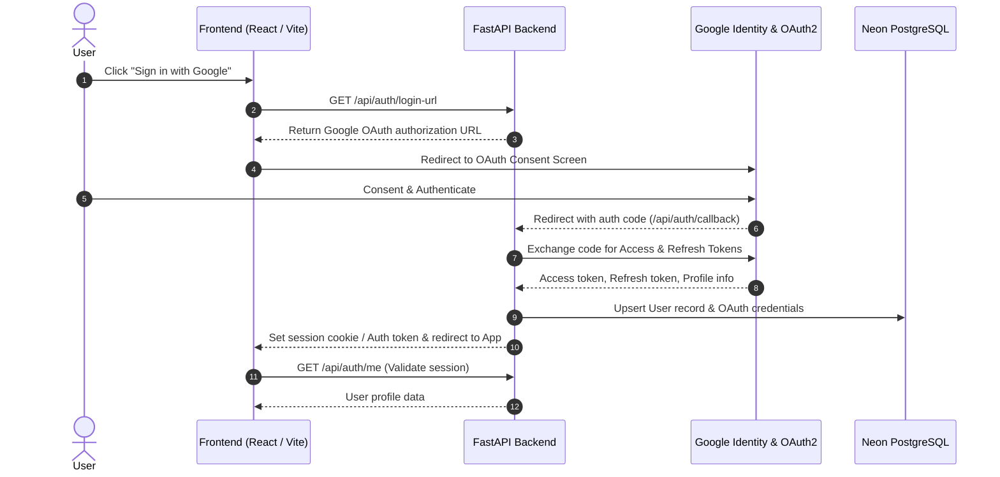
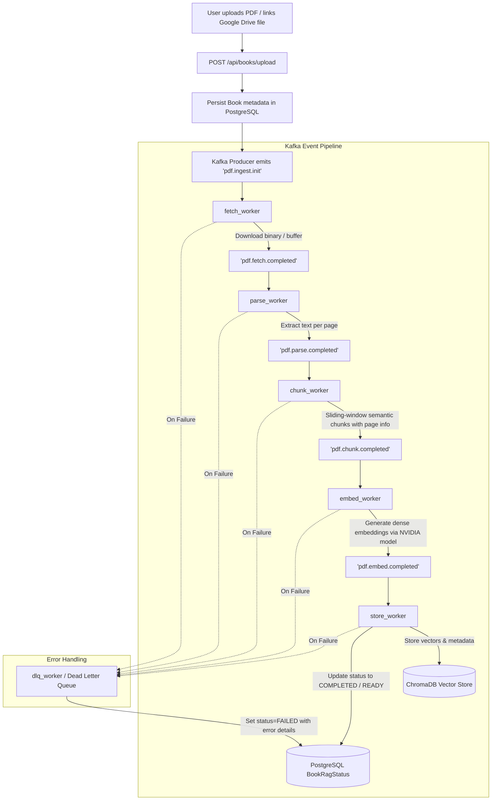
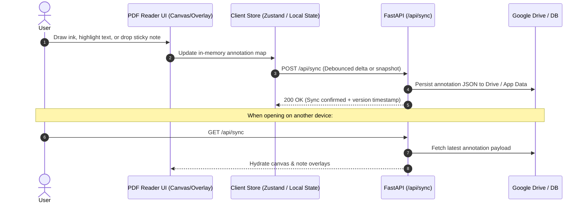
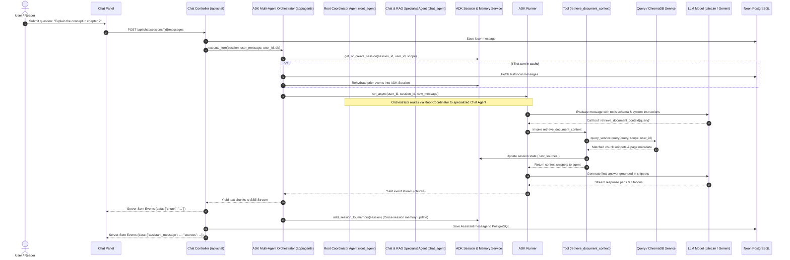

# System Flows & Data Pipelines: Cloud PDF Reader

This document details the primary lifecycle and data flows within **Cloud PDF Reader**, covering user authentication, PDF ingestion, annotation synchronization, and RAG chat interaction.

---

## 1. Authentication & Session Flow

---

## 2. Book Ingestion & Kafka Processing Pipeline

When a user imports or uploads a book, it is pushed through an asynchronous Kafka pipeline for text extraction, chunking, embedding, and vector storage.

---

## 3. Reading & Annotation Sync Flow

---

## 4. Google ADK 2.0 RAG Chat & Memory Flow

