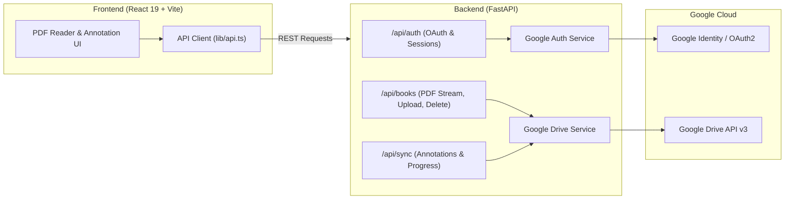

# 📖 Cloud PDF Reader

> A modern, cloud-synchronized PDF reading and annotation platform. Store and sync your books, highlights, drawings, and notes across all your devices using Google Drive.

---

## ✨ Features

- ☁️ **Google Drive Synchronization**: Books and annotation metadata are stored directly in your private Google Drive (`drive.file` scope).
- 🔒 **Secure Backend Architecture**: Google OAuth 2.0 flow and all Google Drive API v3 operations are managed by a FastAPI backend.
- 🎨 **Rich Annotation Toolkit**:
  - 🖍️ **Freehand Ink & Highlighter**: Smooth drawing with customizable color, width, and opacity.
  - 📐 **Precision Shapes**: Rectangles, circles, lines, and arrows.
  - 📝 **Sticky Notes & Text Boxes**: Rich commentary and inline text notes.
  - 🔍 **Text Highlights**: Multi-color highlighting with attached note cards.
- 📑 **Fast PDF Engine**: Powered by PDF.js with continuous page scrolling, thumbnail navigation, responsive zoom, and dark mode.
- 📱 **Responsive & Mobile-Ready**: Slide-over drawers and touch-optimized gestures for tablet and mobile readers.

---

## 🏗️ Architecture



---

## 📁 Project Structure

```
cloud-pdf-reader/
├── backend/
│   ├── app/
│   │   ├── api/
│   │   │   ├── auth.py          # OAuth URLs, callback & sessions
│   │   │   ├── books.py         # Book listing, streaming, upload & delete
│   │   │   └── sync.py          # Full sync metadata management
│   │   ├── services/
│   │   │   ├── google_auth_service.py   # Token exchange & user profile
│   │   │   ├── google_drive_service.py  # Google Drive v3 API client
│   │   │   └── session.py               # Auth dependency & token decode
│   │   ├── config.py            # Environment configuration
│   │   ├── schemas.py           # Pydantic models & data validation
│   │   └── main.py              # FastAPI application entrypoint
│   ├── requirements.txt         # Python dependencies
│   └── .env.example             # Backend environment template
│
├── frontend/
│   ├── src/
│   │   ├── components/
│   │   │   ├── AnnotationPanel.tsx   # Annotation sidebar & filters
│   │   │   ├── DocumentSidebar.tsx   # Bookshelf, upload & search
│   │   │   ├── PDFPageItem.tsx       # Canvas drawing & overlay layer
│   │   │   ├── PDFReader.tsx         # Document viewer & toolbar
│   │   │   └── ThumbnailSidebar.tsx  # Page thumbnail previews
│   │   ├── lib/
│   │   │   └── api.ts                # Backend REST API client
│   │   ├── App.tsx                   # Main reader display application
│   │   ├── types.ts                  # TypeScript interfaces
│   │   └── index.css                 # Theme & Tailwind styling
│   ├── package.json
│   └── vite.config.ts                # Vite dev server & API proxy
│
└── .gitignore
```

---

## 🚀 Getting Started

### Prerequisites
- **Python**: 3.10+
- **Node.js**: 18+
- **Google Cloud Project** with **Google Drive API** enabled

---

### 1. Google Cloud Console Setup

1. Go to the [Google Cloud Console](https://console.cloud.google.com/).
2. Create a new project (or select an existing one) and enable the **Google Drive API**.
3. Go to **APIs & Services** → **OAuth consent screen**:
   - User Type: **External**
   - Add scope: `https://www.googleapis.com/auth/drive.file`
4. Go to **Credentials** → **Create Credentials** → **OAuth Client ID**:
   - Application type: **Web application**
   - **Authorized JavaScript origins**:
     - `http://localhost:3000`
     - `http://localhost:8000`
   - **Authorized redirect URIs**:
     - `http://localhost:8000/api/auth/callback`
5. Note down your **Client ID** and **Client Secret**.

---

### 2. Backend Setup

1. Navigate to `backend/` and set up your virtual environment:
   ```bash
   cd backend
   python -m venv .venv
   ```

2. Activate the virtual environment:
   - **Windows (PowerShell)**:
     ```powershell
     .\.venv\Scripts\Activate.ps1
     ```
   - **macOS / Linux**:
     ```bash
     source .venv/bin/activate
     ```

3. Install dependencies:
   ```bash
   pip install -r requirements.txt
   ```

4. Create your `.env` file (copied from `.env.example`):
   ```env
   GOOGLE_CLIENT_ID="YOUR_GOOGLE_CLIENT_ID.apps.googleusercontent.com"
   GOOGLE_CLIENT_SECRET="YOUR_GOOGLE_CLIENT_SECRET"
   GOOGLE_REDIRECT_URI="http://localhost:8000/api/auth/callback"
   FRONTEND_URL="http://localhost:3000"
   SESSION_SECRET="your-secure-random-session-secret"
   ```

5. Start the FastAPI server:
   ```bash
   python -m uvicorn app.main:app --reload --port 8000
   ```
   - Backend API: `http://localhost:8000`
   - Swagger Documentation: `http://localhost:8000/docs`

---

### 3. Frontend Setup

1. Open a new terminal and navigate to `frontend/`:
   ```bash
   cd frontend
   ```

2. Install dependencies:
   ```bash
   npm install
   ```

3. Start the Vite development server:
   ```bash
   npm run dev
   ```
   - App URL: `http://localhost:3000`

---

## 📡 API Reference

| Method | Endpoint | Description |
|---|---|---|
| `GET` | `/api/auth/url` | Get Google OAuth consent URL |
| `GET` | `/api/auth/callback` | OAuth redirect callback (exchanges code & sets session) |
| `POST` | `/api/auth/token` | Exchange authorization code or token from client |
| `GET` | `/api/auth/me` | Fetch authenticated user profile |
| `POST` | `/api/auth/logout` | Invalidate and clear current session |
| `GET` | `/api/books` | List user's PDF files in Drive merged with progress |
| `GET` | `/api/books/{id}/content` | Stream PDF binary bytes from Google Drive |
| `POST` | `/api/books/upload` | Upload new PDF to Drive and initialize sync data |
| `DELETE` | `/api/books/{id}` | Delete PDF document from Google Drive |
| `PATCH` | `/api/books/{id}/progress` | Update annotations, notes, and reading page in Drive |
| `GET` | `/api/sync` | Fetch full `cloud_pdf_reader_sync.json` from Drive |
| `PUT` | `/api/sync` | Replace full sync metadata in Google Drive |

---

## 🛠️ Tech Stack

- **Backend**: FastAPI, Pydantic, HTTPX, PyJWT, Uvicorn, Python Multipart
- **Frontend**: React 19, TypeScript, Vite, Tailwind CSS, PDF.js, Lucide Icons
- **Cloud Storage**: Google Drive API v3 (`drive.file` scope)
- **Auth**: Google OAuth 2.0

---

## 📄 License

MIT License. Feel free to use and customize for your own projects!
